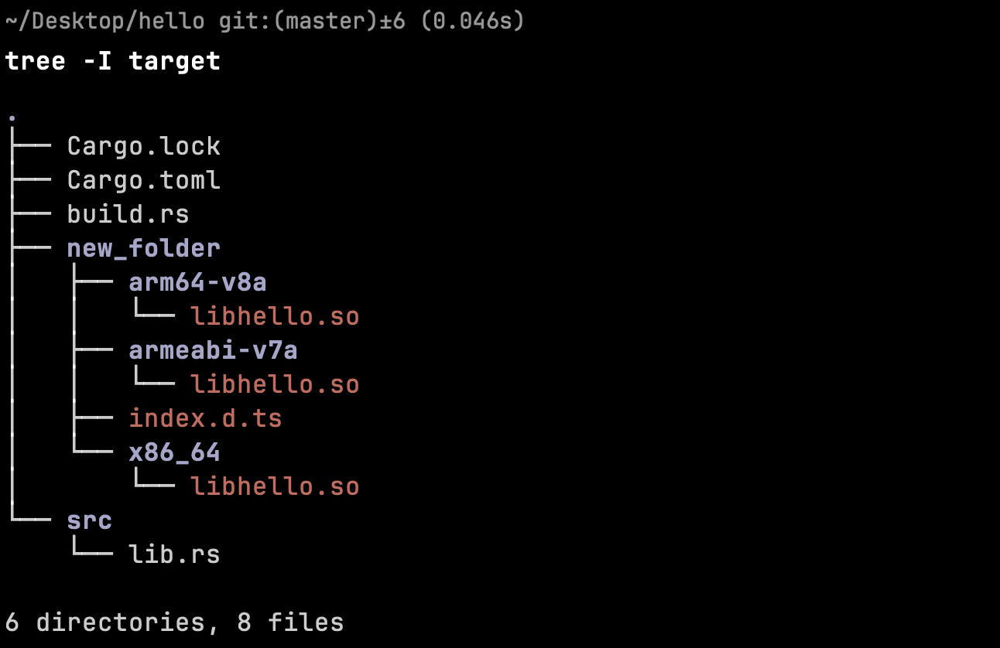

# Build

As another useful subcommand, it helps us to build the final binary and generate `.d.ts`. Standard command will be:

```shell
ohrs build
```

It supports some special options.

| Options | description                                                                                           | type      | default |
|---------|:------------------------------------------------------------------------------------------------------|:----------|:--------|
| release | build mode,if it be set with true, project will build with `release` mode                             | `boolean` | false   |
| dist    | The final binary's folder                                                                             | `string`  | dist    |
| strip   | Use `llvm-strip` to reduce the size of the binary files. Set the mode to true if it's in release mode | `boolean` | true    |


## Usage

Here are some examples to use them.

### --release

```shell
ohrs build --release
```

If we use `--release`, project will build with `release` mode.

### --compact

```shell
ohrs build --compact
```

If we use `--compact`, the final folder will be:


All the final binary will in a same folder.

### --dist new_folder

```shell
cargo build --dist new_folder
```

Now, the final project structure will be:




### --strip

```shell
# enabled
cargo build --strip

# disabled
cargo build --strip=false
```
